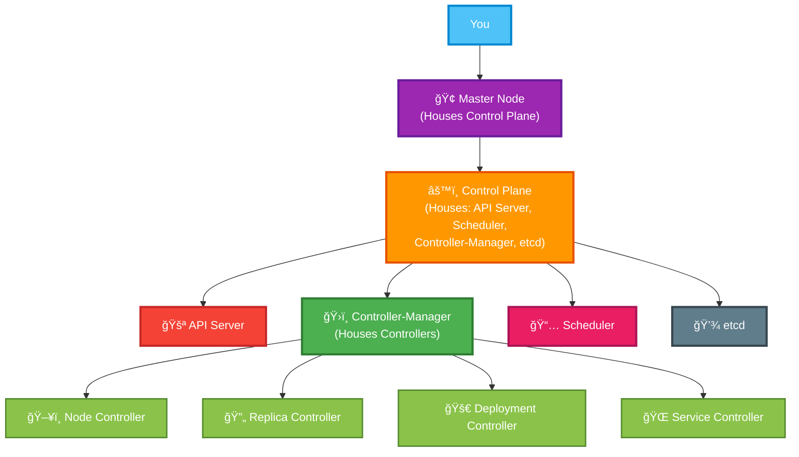

# Kubernetes Architecture and Networking

## Architecture Diagram

```mermaid
graph TD
    A[You] --> B["🢠Master Node<br/>(Houses Control Plane)"]
    B --> C["âš™ï¸ Control Plane<br/>(Houses: API Server, Scheduler,<br/>Controller-Manager, etcd)"]
    
    C --> D["🚪 API Server"]
    C --> E["ğŸ›ï¸ Controller-Manager<br/>(Houses Controllers)"] 
    C --> F["📅 Scheduler"]
    C --> G["💾 etcd"]
    
    E --> H["ğŸ–¥ï¸ Node Controller"]
    E --> I["🔄 Replica Controller"]
    E --> J["🚀 Deployment Controller"]
    E --> K["🌠Service Controller"]
    
    style A fill:#4FC3F7,stroke:#0288D1,stroke-width:3px,color:#fff
    style B fill:#9C27B0,stroke:#6A1B9A,stroke-width:3px,color:#fff
    style C fill:#FF9800,stroke:#E65100,stroke-width:3px,color:#fff
    style D fill:#F44336,stroke:#C62828,stroke-width:3px,color:#fff
    style E fill:#4CAF50,stroke:#2E7D32,stroke-width:3px,color:#fff
    style F fill:#E91E63,stroke:#AD1457,stroke-width:3px,color:#fff
    style G fill:#607D8B,stroke:#37474F,stroke-width:3px,color:#fff
    style H fill:#8BC34A,stroke:#558B2F,stroke-width:2px,color:#fff
    style I fill:#8BC34A,stroke:#558B2F,stroke-width:2px,color:#fff
    style J fill:#8BC34A,stroke:#558B2F,stroke-width:2px,color:#fff
    style K fill:#8BC34A,stroke:#558B2F,stroke-width:2px,color:#fff
```

## Network Flow Diagram

```mermaid
graph TD
    subgraph "Administrative Flow (kubectl)"
        A[You] -->|kubectl| B[API Server on Control Plane] 
        B -->|manages| C[Pods]
    end
    
    subgraph "Web Traffic Flow"
        D[You/External Clients] -->|web requests| E[NodePort on Ubuntu Server]
        E -->|forwards to| F[Apps/Pods at Port 80]
    end
    
    subgraph "Pod Communication"
        G[kube-proxy system app] -->|allows| H[Pods Communication]
    end
    
    style A fill:#e1f5fe
    style D fill:#e1f5fe
    style B fill:#ffebee
    style C fill:#e8f5e8
    style E fill:#fff3e0
    style F fill:#e8f5e8
    style G fill:#f3e5f5
    style H fill:#e8f5e8
```
