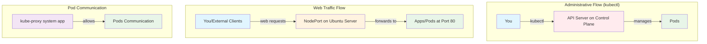

## Kubernetes Networking Flow Diagram

```mermaid
graph TD
    subgraph "Administrative Flow (kubectl)"
        A[You] -->|kubectl| B[API Server on Control Plane] 
        B -->|manages| C[Pods]
    end
    
    subgraph "Web Traffic Flow"
        D[You/External Clients] -->|web requests| E[NodePort on Ubuntu Server]
        E -->|forwards to| F[Apps/Pods at Port 80]
    end
    
    subgraph "Pod Communication"
        G[kube-proxy system app] -->|allows| H[Pods Communication]
    end
    
    style A fill:#e1f5fe
    style D fill:#e1f5fe
    style B fill:#ffebee
    style C fill:#e8f5e8
    style E fill:#fff3e0
    style F fill:#e8f5e8
    style G fill:#f3e5f5
    style H fill:#e8f5e8
```
